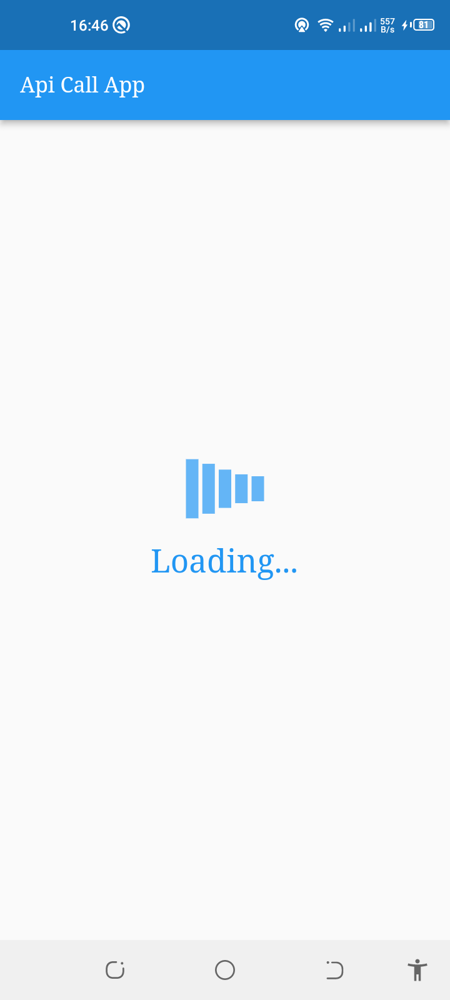
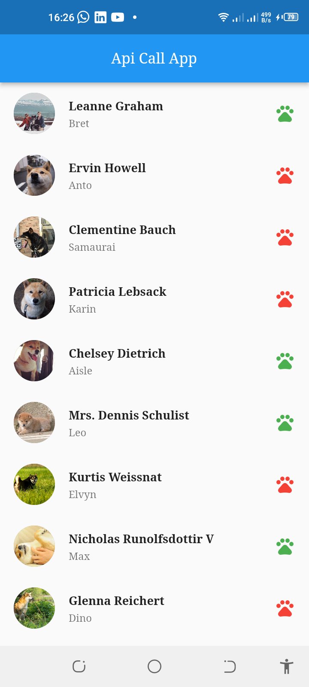

# flutter_api_practice

A new Flutter project.

## Getting Started

This project is a starting point for a Flutter application.

A few resources to get you started if this is your first Flutter project:

- [Lab: Write your first Flutter app](https://docs.flutter.dev/get-started/codelab)
- [Cookbook: Useful Flutter samples](https://docs.flutter.dev/cookbook)

For help getting started with Flutter development, view the
[online documentation](https://docs.flutter.dev/), which offers tutorials,
samples, guidance on mobile development, and a full API reference.

## Getting Started
To run this project,

You need to have Flutter installed on your machine. You can find the installation guide here.[Installation Guideline](https://docs.flutter.dev/get-started/install?gclid=Cj0KCQjwu-KiBhCsARIsAPztUF0h90aHI1ZYo_l-GRMmEOg6KQFbBij1HOyYwBLybxhXqOhh68HDYJwaAjP-EALw_wcB&gclsrc=aw.ds)
Clone this repository
- Run flutter pub get to install all the dependencies
- Run flutter pub run build_runner build  to generate the files for floor database
- Run flutter run to run the app on your device or emulator

## Screenshots

  <table>
    <tr>
        <td></td>
        <td></td>
    </tr>  
    </table>

